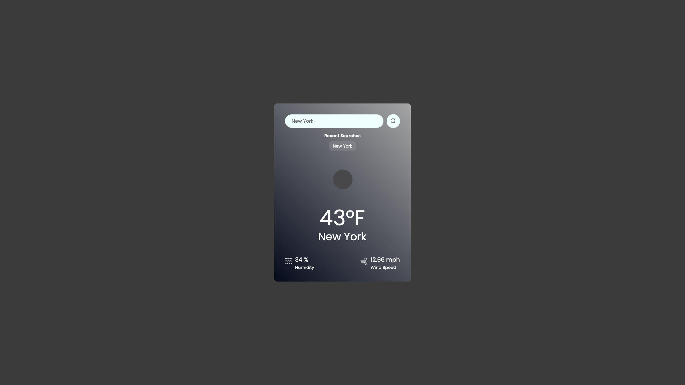

# 🌦️ Weather App

A modern, fully responsive weather application built using **React**, **Vite**, and the **OpenWeatherMap API**. This app allows users to search for weather in any city and view real-time data including temperature, humidity, wind speed, and weather icons. 

By default, the app automatically initializes with weather data for **Australia** on launch. It also supports keyboard search, displays clickable search history (up to 5 recent cities), and includes clean, mobile-friendly styling.

---

## 🚀 Features

- 🔍 Search weather by city
- 🌤️ Displays:
  - Temperature (°F)
  - Humidity (%)
  - Wind speed (mph)
- 🖼️ Live weather icons from OpenWeatherMap
- ⌨️ Search using Enter key or search icon
- 🕘 Clickable recent search history (max 5 cities)
- 📱 Responsive design for all screen sizes
- 🔐 Secure API key using `.env`

---

## 📦 Tech Stack

- **Frontend**: React + Vite
- **Styling**: HTML & CSS (custom styles)
- **API**: OpenWeatherMap API
- **JavaScript**: ES6+ syntax

---

## 🧠 App Behavior

### Search Functionality

```jsx
<input
  ref={inputRef}
  type="text"
  placeholder="Search"
  onKeyDown={(e) => {
    if (e.key === "Enter") {
      search(inputRef.current.value);
    }
  }}
/>
 search(inputRef.current.value)}
/>
```

---

### Search History Logic

Each successful search is added to an array:

```js
setSearchHistory((prevHistory) => {
  const formattedCity = city.trim();
  if (!prevHistory.includes(formattedCity)) {
    return [formattedCity, ...prevHistory].slice(0, 5);
  }
  return prevHistory;
});
```

---

## 📸 Screenshots

### 🌤️ Weather Display


### 🔍 Search Feature


### 🕘 Search History


---

## 🙋‍♂️ Author

**Ihsan Bedru**  
📧 ihsanbed@gmail.com  
🐙 [GitHub – ihsanbed](https://github.com/ihsanbed)

---

## 📄 License

This project is licensed under the **MIT License** — free to use, modify, and distribute.

---

Made with 💙 by **Ihsan Bedru**
